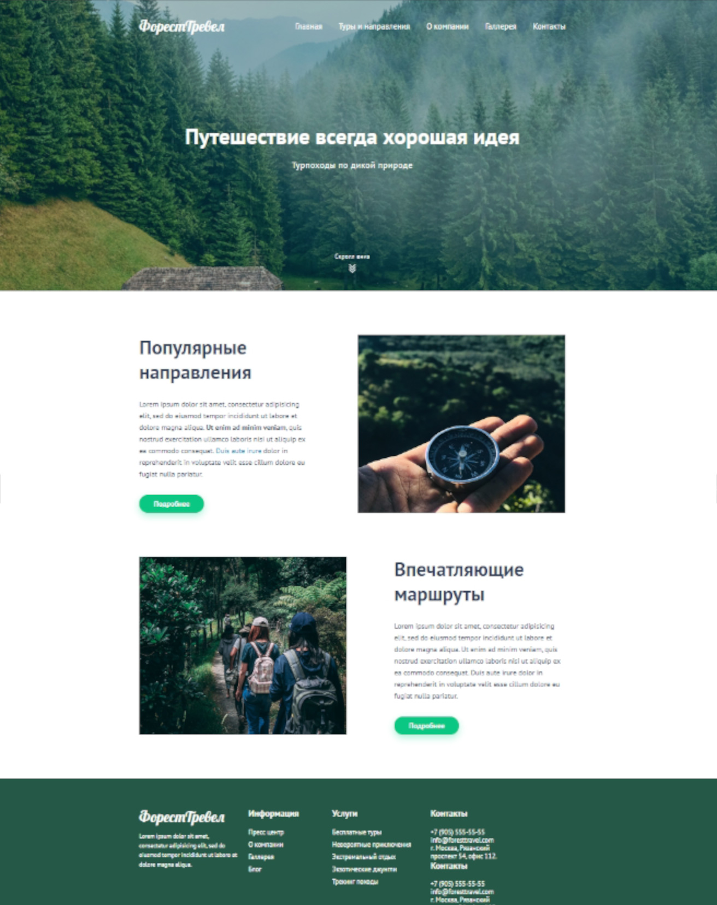

# Сайт турагенства "Форест тревел"

## О проекте:

Сайт для туристического агенства. Учебный проект, созданный в рамках прохождения обучения по вёрстке на онлайн курсах от [Webcademy.ru](https://webcademy.ru/).

* Срок выполнения: 5 дней
* Количество страниц: 8
* Демо онлайн: [forest-travel-by-valerian.netlify.app](https://forest-travel-by-valerian.netlify.app/)
* Код на Github: [github.com/Anatoluch/project-forest-travel](https://github.com/Anatoluch/project-forest-travel)

## Технологии:

HTML5, CSS3.

## Особенности:

Pixel Perfect верстка по PSD макету.
___
_Если Вам нужен специалист по верстке сайтов - обращайтесь! Я с удовольствием помогу!_
